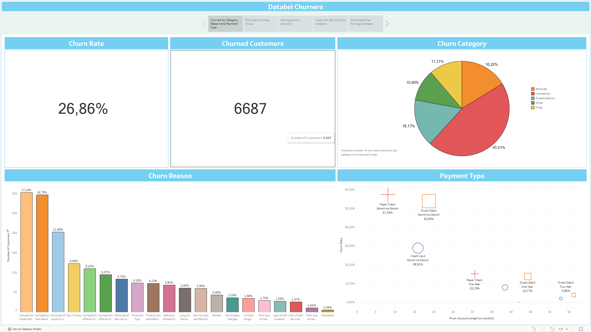
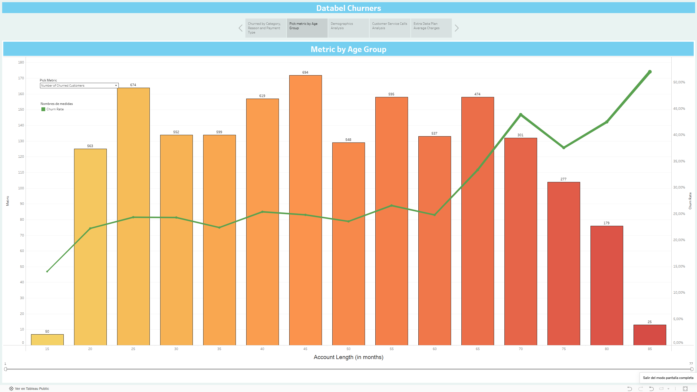
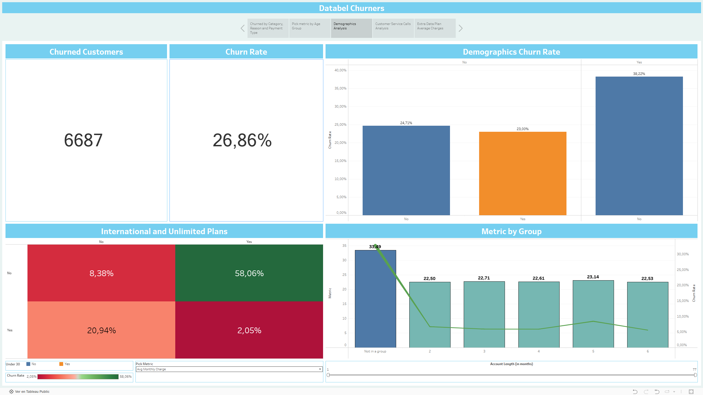
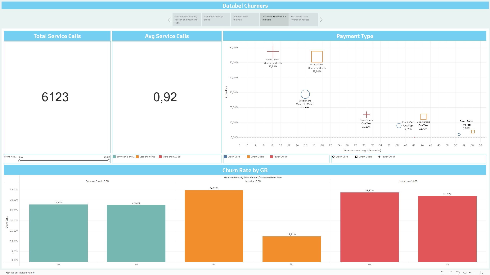
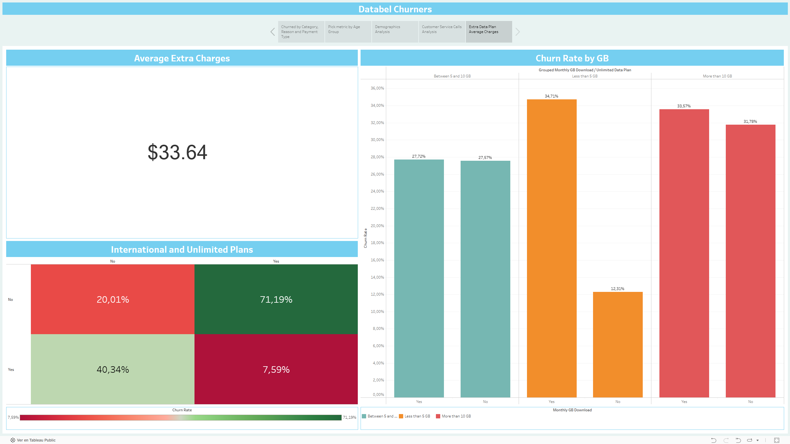

# Customer Churn Analytics Story

An interactive Tableau Public story analyzing customer churn rate, churn reasons, payment type behavior, demographics, customer service interactions, and extra data plan charges.

## Tableau Public Dashboard

[View the interactive Tableau dashboard](https://public.tableau.com/app/profile/carlos.miranda.rocha/viz/Sample1_17148919910730/DatabelChurners)

## Overview

This repository documents a Tableau Public portfolio project focused on customer churn exploration through dashboard storytelling. It is designed to present business-facing observations, highlight potential churn drivers, and communicate insights clearly for stakeholders.

## Business Problem

Customer churn analysis helps companies understand why customers leave, which customer groups are most at risk, and which operational or service-related factors may be associated with churn. This supports better retention strategy design and prioritization of improvement initiatives.

## Business Questions

- What is the overall churn rate?
- How many customers churned?
- Which churn categories are most common?
- Which churn reasons appear most frequently?
- How does churn vary by payment type?
- How do demographics relate to churn?
- Are customer service calls associated with churn behavior?
- Do extra data plan charges show meaningful churn patterns?

## Dashboard Pages

- Churned by Category, Reason and Payment Type
- Pick Metric by Age Group
- Demographics Analysis
- Customer Service Calls Analysis
- Extra Data Plan Average Charges

## Key Insights

These are dashboard-level observations and should be validated with the full dataset before making business decisions.

- The dashboard reports an overall churn rate of 26.86%.
- The dashboard reports 6,687 churned customers.
- Competitor-related reasons appear as a major contributor to churn.
- Churn analysis by payment type suggests that account length and payment method may relate to churn behavior.
- Additional dashboard pages explore churn from demographic, customer service, and extra data charge perspectives.

## Screenshots







## Tools Used

- Tableau Public
- Data visualization
- Churn analysis
- Dashboard storytelling
- Business intelligence

## Repository Structure

```text
customer-churn-tableau-story/
├── README.md
├── screenshots/
│   ├── 01_dashboard_overview.png
│   ├── 02_churn_reasons.png
│   ├── 03_payment_type_analysis.png
│   ├── 04_demographics_analysis.png
│   └── 05_customer_service_analysis.png
├── docs/
│   ├── dashboard_notes.md
│   ├── business_questions.md
│   ├── insights_summary.md
│   ├── limitations.md
│   └── data_dictionary.md
└── assets/
    └── .gitkeep
```

## Limitations

- This is a Tableau Public portfolio project.
- The analysis depends on the available dataset and dashboard-level aggregations.
- The dashboard identifies patterns and exploratory insights, not causal relationships.
- Further statistical analysis would be needed before making operational decisions.

## Future Improvements

- Add predictive churn modeling.
- Add cohort analysis.
- Add customer lifetime value analysis.
- Add deeper segmentation by customer tenure and service usage.
- Rebuild the dashboard in Power BI or a modern BI style if needed.
- Add a written executive summary PDF.
